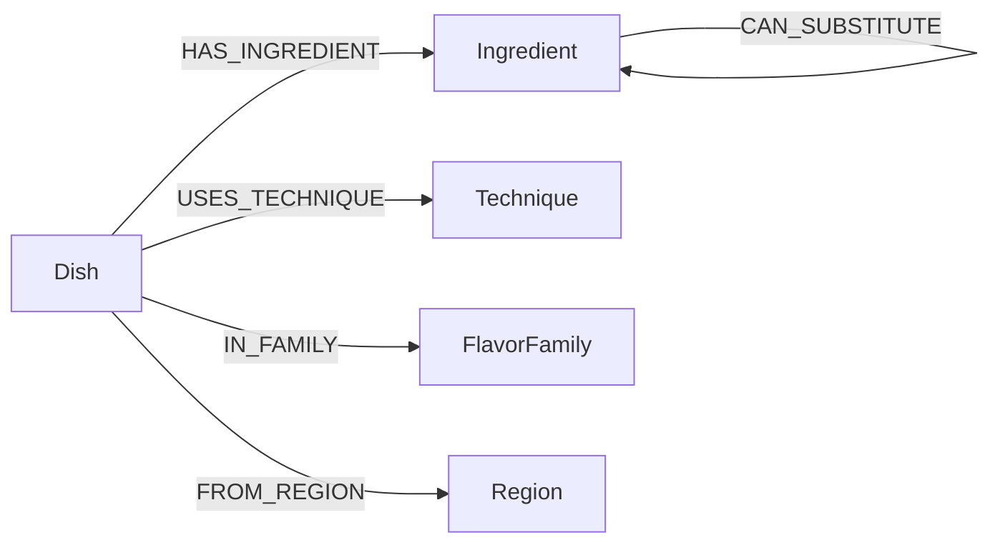

# On Hand

A dinner app for the moment you are already in the kitchen. You tap what is on the shelf, set tonight’s constraints, and swipe a deck of meals **walked from a kitchen graph** — ingredients, typed substitutes, techniques, flavor families, and regions — not keyword-matched recipes.

v1 is a focused Indian home-cooking graph (thin North + South). Built as a CognoDB / openCypher take-home: the interesting questions are about _connections_.

## Why a graph database?

A relational schema can list “dishes have ingredients.” It starts to strain when dinner is a **path**:

- You are missing tamarind, but you have lemon, and lemon **can substitute** for tamarind _in souring_, not in every dish.
- You named butter chicken; paneer butter masala is a **cousin** because they share a flavor family and a simmered-gravy technique, not because their names are similar.
- Left-swipe “too familiar” should leave the **staple dishes in that family** and walk toward a different technique in the same region.

Those are multi-hop traversals with typed edges. In SQL they become recursive joins plus a substitute table plus a family table plus special-case ranking. In CognoDB they are the data model.

## Data model



`CAN_SUBSTITUTE` is directed and contextual: yogurt can stand in for cream in a makhani gravy; it cannot replace yogurt in curd rice by reversing the same edge blindly.

The **kitchen session** (pantry, leftover tags, time, diet, shop-one, bookmarks) lives in Redux + localStorage on this device. There is no auth. CognoDB is the source of truth for the graph only.

## Setup

### 1. CognoDB Cloud

1. Sign up at [console.cognodb.com/signup](https://console.cognodb.com/signup).
2. Create a free (c0) instance. Copy the `bolt+s://…` URI and the generated password for user `cognodb` (shown once).
3. Keep the instance running so the hosted demo stays live.

### 2. App

```bash
npm install
cp .env.example .env.local
```

Fill in:

```env
COGNODB_URI=bolt+s://<instance-id>.databases.cognodb.cloud
COGNODB_USERNAME=cognodb
COGNODB_PASSWORD=<your password>
```

Never commit `.env.local`.

```bash
npm run seed
npm run dev
```

Open [http://localhost:3000](http://localhost:3000). The first screen is a filled demo pantry. Edit it, optionally name a dish you loved, then **Find tonight**.

To re-record the walkthrough in `docs/demo.webm` (dev server must be running):

```bash
npm run record
```

### 3. Hosted demo (Vercel)

Keep the CognoDB instance running until Wexa reviews. Hosting: Vercel — add the three env vars in the project settings, then deploy. Seed is run **locally** against CognoDB (`npm run seed`); you do not seed from Vercel.

## Main queries

All Cypher is parameterized via the official `neo4j-driver` (v6.2). No string-concatenated queries.

**Makeable now, with a substitute hop (2+ hops).** For each required ingredient on a dish, we treat it as covered if it is in `$pantry` _or_ there is a `CAN_SUBSTITUTE` edge from a pantry ingredient to it:

```cypher
MATCH (d:Dish)-[:HAS_INGREDIENT]->(ing:Ingredient)
OPTIONAL MATCH (ing)<-[:CAN_SUBSTITUTE]-(alt:Ingredient)
WHERE alt.slug IN $pantry
```

That is the “sambar without tamarind, but lemon is on the shelf” path.

**Cousin of a named dish (awkward in SQL).** From a seed dish we walk `IN_FAMILY` / `FROM_REGION` / `USES_TECHNIQUE` and rank other dishes by pantry coverage plus family overlap — name similarity is never used.

**Left-swipe steer.** “Too heavy” drops `heaviness = rich`. “Too long” tightens `maxMinutes`. “Too familiar” downranks staples in the rejected flavor family and boosts cousins (same family, different technique).

See `lib/cypher/` and `lib/ranking.ts`.

## App map

| Route          | What happens                                                                         |
| -------------- | ------------------------------------------------------------------------------------ |
| `/`            | Pantry (search + aisles), leftover tags, time / diet / shop-one, optional named dish |
| `/tonight`     | Swipe deck with a visible graph reason on every card                                 |
| `/dish/[slug]` | Have / missing / swap-with-why + short steps                                         |
| `/saved`       | Session bookmarks on this device                                                     |

## Stack

- Next.js 16 App Router (Route Handlers, Node runtime — Bolt is not Edge-safe)
- CognoDB via `neo4j-driver@6.2.0`
- Redux Toolkit + redux-persist
- Tailwind CSS 4

## Demo

Playwright recording of the live app: pantry (search + aisles), optional “cousin of butter chicken,” the swipe deck, a dish with have/swap/steps, then Saved.


Source recording: [docs/demo.webm](docs/demo.webm). Regenerate with `npm run record` while `npm run dev` is running.
